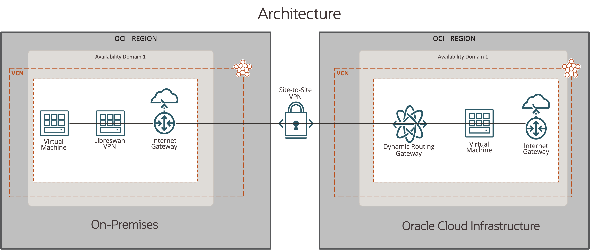

<div id="top"></div>
<!--
*** Thanks for checking out the Best-README-Template. If you have a suggestion
*** that would make this better, please fork the repo and create a pull request
*** or simply open an issue with the tag "enhancement".
*** Don't forget to give the project a star!
*** Thanks again! Now go create something AMAZING! :D
-->


<!-- PROJECT SHIELDS -->
<!--
*** I'm using markdown "reference style" links for readability.
*** Reference links are enclosed in brackets [ ] instead of parentheses ( ).
*** See the bottom of this document for the declaration of the reference variables
*** for contributors-url, forks-url, etc. This is an optional, concise syntax you may use.
*** https://www.markdownguide.org/basic-syntax/#reference-style-links
-->
<!-- [![Contributors][contributors-shield]][contributors-url] -->

[![LinkedIn][linkedin-shield]][linkedin-url]
![GitHubForks][forks-shield]
![GitHubIssues][issues-shield]
![GitHubRepoStars][stars-shield]
![GitHubDownloads][downloads-shield]

<!-- PROJECT LOGO -->
<br />
<div align="center">

  <h3 align="center">IPSec Site-to-Site Tunnel with OCI & Libreswan VPN</h3>

</div>


<!-- TABLE OF CONTENTS -->
<details>
  <summary>Table of Contents</summary>
  <ol>
    <li>
      <a href="#about-the-project">About The Project</a>
      <ul>
        <li><a href="#built-with">Built With</a></li>
      </ul>
    </li>
    <li><a href="#Summary-of-OCI-Networking-and-Compute-Services">Summary of OCI Networking and Compute Services</a></li>        
    <li>
      <a href="#getting-started">Getting Started</a>
      <ul>
        <li><a href="#prerequisites">Prerequisites</a></li>
        <li><a href="#installation">Installation</a></li>
      </ul>
    </li>
    <li><a href="#Known Issues">Known Issues</a></li>
    <li><a href="#contact">Contact</a></li>
    <li><a href="#acknowledgments">Acknowledgments</a></li>
  </ol>
</details>


<!-- ABOUT THE PROJECT -->
## About The Project

As cloud adoption continues to gain momentum in 2021, IPSec Tunnels remain a de facto standard for customers to establish secure access across their multi-cloud environments.  IPSec can be thought of as a security framework that consists of protocols responsible for negotiating IPSec parameters and defining how the IPSec protocol encapsulates, authenticates and encrypts the data within the tunnel.  We are pleased to announce the general availability of IPSec Tunnel Customizations for Oracle Cloud Infrastructure (OCI) Site-to-Site VPN Connect v2 service.  We're enabling this feature to address demands for new use cases around flexibility, standardization, compliance and operational efficiency when designing and deploying Site-to-Site IPSec VPN tunnels.

Enabling IPSec Customizations for Site-to-Site VPN tunnels provides the following additional capabilities and benefits:

**Use Cases:**

* Flexibility, Standardization and Compliance  - Customers can now comply with their best practice configuration standards with flexibility to support various combinations of phase 1 and phase 2 IKE proposals and combinations of security association lifetimes, dead peer detection, IKE initiation and NAT translation settings.  For example, it's now possible to send ONLY approved phase 1 and phase 2 parameters to meet internal/external security compliance policies or vendor CPE compatibility. 
* Operational Efficiency - You can now view the security associations for a tunnel within the console to better troubleshoot errors. Additionally, tunnels that use BGP routing will now show the routes received and sent to the Customer-Premises Equipment (CPE) which aids in the verification, validation and troubleshooting of BGP routing over the tunnel.  Lastly, when Oracle detects an issue that prevents the establishment of an IPSec tunnel, the console will show troubleshooting information to assist with tunnel set up.

The objective of this project is as follows: Programmatically spin up an environment for quick functional testing of IPSec Customizations leveraging Terraform and Ansible.


#### Built With

Below are the versions of software that were used at the time this code was created.

* [Libreswan](https://libreswan.org/), = version 4.5
* [Quagga](https://www.quagga.net/), = version 1.2.0
* [Terraform](https://www.terraform.io/), version = 1.0.11
* [OCI Terraform Provider](https://registry.terraform.io/providers/hashicorp/oci/latest), version 4.56.0
* [Ansible](https://www.ansible.com/), version = core 2.12

<p align="right">(<a href="#top">back to top</a>)</p>

## Summary of OCI Networking and Compute Services

This setup leverages two Oracle Cloud Infrastructure VCNs within the same tenancy - acting as on-premises and cloud data centers.

**Oracle Cloud Infrastructure Side:**
* VCN
* Subnet
* Route Table and Rules
* Security List and Rules
* Dynamic Routing Gateway (DRG)
* Internet Gateway (IGW)
* IPSec Connection
* Route Import Distribution Lists and Rules
* A compute instance for connectivity testing within the OCI VCN

**On-Premises Side:**
* VCN
* Subne
* Route Table and Rules
* Security List and Rules
* Internet Gateway (IGW)
* A Libreswan compute instance acting as the CPE device in this scenario



<p align="right">(<a href="#top">back to top</a>)</p>

<!-- GETTING STARTED -->
## Getting Started

### Prerequisites
1. Install Terraform
2. Install Ansible
3. Access to Oracle CLoud Infastructure
3. Download or clone the repo to your local machine
  ```sh
  git clone git@github.com:oracle-quickstart/oci-ipsec-libreswan.git
  ```
4. Update the *variables.tf* or terraform.tfvars file tom match your enviornment
5. Update the *libreswan.j2* file with the tunnel IP addresses
6. Run Terraform
  ```sh
  terraform init
  terraform plan
  terraform apply
  ```

<!-- CONTRIBUTING -->
## Contributing

Contributions are what make the open source community such an amazing place to learn, inspire, and create. Any contributions you make are **greatly appreciated**.

If you have a suggestion that would make this better, please fork the repo and create a pull request. You can also simply open an issue with the tag "enhancement".
Don't forget to give the project a star! Thanks again!

1. Fork the Project
2. Create your Feature Branch (`git checkout -b feature/AmazingFeature`)
3. Commit your Changes (`git commit -m 'Add some AmazingFeature'`)
4. Push to the Branch (`git push origin feature/AmazingFeature`)
5. Open a Pull Request

<p align="right">(<a href="#top">back to top</a>)</p>

<!-- CONTACT -->
## Known Issues

1. IPSEC Tunnel renaming Error

The following error is a know issue.  Re-apply Terraform and the issue will resolve on its own as a workaround

```Error: 409-IncorrectState 
│ Provider version: 4.56.0, released on 2021-12-08.  
│ Service: Core Ip Sec Connection Tunnel Management 
│ Error Message: Resource ocid1.ipsecconnection.oc1.iad.aaaaaaaa27zc7qypdgg47yl3qt7tltnx4no57k2ypxpm63vmcrmamthcciza is in an invalid state Provisioning 
│ OPC request ID: 1e68bf5cb7e3cabcd2b581e272a3786d/EDCB425B3A799CD3DAB519A133EE0443/D85A86FA9B06CF360219D4CA8F309170 
│ Suggestion: The resource is in a conflicted state. Please retry again or contact support for help with service: Core Ip Sec Connection Tunnel Management
│ 
│ 
│   with oci_core_ipsec_connection_tunnel_management.oci-ipsec-connection-tunnel-management-b,
│   on networking.tf line 305, in resource "oci_core_ipsec_connection_tunnel_management" "oci-ipsec-connection-tunnel-management-b":
│  305: resource "oci_core_ipsec_connection_tunnel_management" "oci-ipsec-connection-tunnel-management-b" {
  ```

<!-- CONTACT -->
## Contact

Your Name - Troy Levin - troy.levin@oracle.com

Project Link: [https://github.com/oracle-quickstart/oci-ipsec-libreswan](https://github.com/oracle-quickstart/oci-ipsec-libreswan)

<p align="right">(<a href="#top">back to top</a>)</p>

<!-- MARKDOWN LINKS & IMAGES -->
<!-- https://www.markdownguide.org/basic-syntax/#reference-style-links -->

[issues-shield]: https://img.shields.io/github/issues/oracle-quickstart/oci-ipsec-libreswan?logo=GitHub
[forks-shield]: https://img.shields.io/github/forks/oracle-quickstart/oci-ipsec-libreswan?logo=Github
[stars-shield]: https://img.shields.io/github/stars/oracle-quickstart/oci-ipsec-libreswan?logo=GitHub
[linkedin-shield]: https://img.shields.io/badge/-LinkedIn-black.svg?style=flat&logo=linkedin&colorB=555
[linkedin-url]: https://www.linkedin.com/in/troy-levin-6bb9a94/
[product-screenshot]: images/screenshot.png
[downloads-shield]: https://img.shields.io/github/downloads/oracle-quickstart/oci-ipsec-libreswan/total?logo=Github 